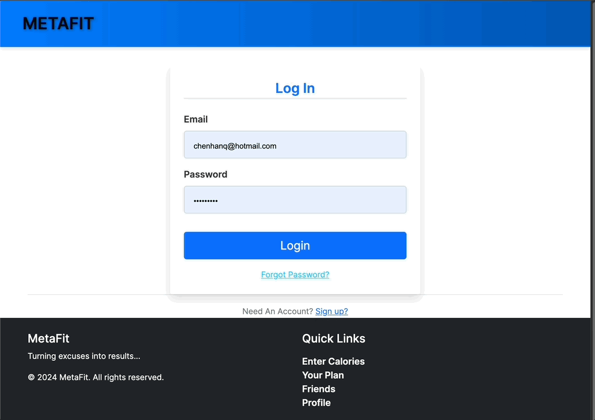

# MetaFit 3.0
<br>
<br>

<p align="center">
  
</p>

<p align="center">
   <a href="https://www.python.org/">
    
  </a>
  <a href="https://www.mongodb.com/">
    
  </a>
  <a href="https://developer.mozilla.org/en-US/docs/Web/HTML">
    
  </a>
  <a href="https://developer.mozilla.org/en-US/docs/Web/JavaScript">
    
  </a>
  <a href="https://github.com/RAV-Organization/SE_Project3_calorieApp_server/blob/meta_2.0_final/LICENSE">
    
  </a>
  <a href="https://doi.org/10.5281/zenodo.14226770">
    
  </a>
  <a href="https://github.com/anuj672/calorieApp_server/graphs/contributors">
    
  </a>
  <a href="https://www.python.org/dev/peps/pep-0008/">
    
  </a>
  <a href="https://github.com/csc-510-group-15/Project2_MetaFit/actions/workflows/Code_Coverage.yml">
    
  </a>
  <a href="https://github.com/csc-510-group-15/Project2_MetaFit/actions/workflows/code_formatter.yml">
    
  </a>
  <a href="https://github.com/csc-510-group-15/Project2_MetaFit/actions/workflows/flake8.yml">
    
  </a>
  <a href="https://github.com/apurv-choudhari/calorieApp_server/actions/workflows/Pylint.yml">
    
  </a>
  <a href="https://github.com/RAV-Organization/SE_Project3_calorieApp_server/issues">
    
  </a>
  <a href="https://github.com/RAV-Organization/SE_Project3_calorieApp_server/issues?q=is%3Aissue+is%3Aclosed">
    
  </a>
</p>


**METAFIT** is an easy-to-use application designed to track daily calories consumed and burned, helping users achieve their health goals—whether it’s weight loss, weight gain, or overall fitness improvement. It offers an intuitive interface where users can update their profiles (including height, weight, goals, and target weight), enroll in various fitness programs (such as yoga and targeted workouts), and receive personalized, AI-powered meal suggestions that match their lifestyle and calorie intake.

**METAFIT** is tailored for a broad audience: from individuals looking to manage their weight and improve their health, to fitness enthusiasts seeking structured workout and nutrition plans. Developers and open-source contributors will also find the documentation helpful, as it provides a comprehensive guide to understanding and enhancing the project.

# Table of Contents  

- [Why use METAFIT?](#why-use-metafit)
- [Additions to METAFIT 3.0](#additions-in-metafit-version-3.0)
- [Practical Applications of METAFIT](#practical-applications-of-metafit)
- [METAFIT 2.0 (Legacy) Features](#metafit-2.0-legacy-features)
  - [Register](#register)
  - [Login](#login)
  - [Edit User Profile](#edit-user-profile)
  - [Log Calories](#log-calories)
  - [Check Your Plan](#check-your-plan)
  - [Friends](#friends)
  - [Log Calorie Burn](#log-calorie-burn)
  - [Water Intake](#water-intake)
  - [Exercise Recommendations](#exercise-recommendations)
  - [Daily Challenges](#daily-challenges)
- [METAFIT 3.0 (New and Updated) Features](#metafit-3.0-new-and-updated-features)
  - [Meal Planning](#meal-planning)
  - [Password Recovery](#password-recovery)
  - [Visual Dashboard](#visual-dashboard)
  - [Profile Badges](#profile-badges)
- [Installation Instructions](#installation-instructions)
- [Kubernetes](#kubernetes)
- [Future Scope](#future-scope)
- [Contributors](#contributors)
- [Contribution](#contribution)
- [License](#license)
- [Software Sustainability Evaluation Self-Assessment Table](#software-sustainability-evaluation-self-assessment-table)
- [Repository Rubric](#repository-rubric)


# Why Use Metafit?
https://github.com/user-attachments/assets/ad8074ca-386d-49f0-b6ea-cd2ffd9b1d58

 - Users can keep track of their daily caloric intake, calculated from food automatically.
 - Displays a day-by-day record of calories consumed VS calories burnt in the history tab.
 - Helps users determine how much to eat and exercise according to their desired goals.
 - Users can connect with their friends and keep track of each other's progress.
 - Share your achievements on social media platforms to build a strong community.
 - Enrollment into numerous yoga and workout sessions.
 - Accessible to everyone and easy to use.
 - Users can obtain customized food plans using sophisticated AI.


# Additions in METAFIT version 3.0

- Users now have access to a beautified navigation panel in their dashboard, with pages organized by function.
- User profiles now include "badges", achievements with several tiers that track lifetime usage of METAFIT.
- Integrated fine-tuned model training to get more accurate meal recommendations.
- Now using a loss-based scoring mechanism to rank and limit meal plan options to the top 5 (instead of the previous ~30, which was confusing).
- Added functionality to calculate users' BMI and offer tailored meal planning advice accordingly.
- Each recommended meal now comes with an image and detailed cooking instructions.
- Users can now reset forgotten passwords using a 2FA code sent to their registered email (replacing the old HTML placeholder).

 # Practical Applications of METAFIT
 
- With the help of our application, users will get to know the proper analysis of their diet and workout plan.
- Detailed trend tracking takes the unknowns out of losing or gaining weight. METAFIT users know exactly how on-track they are whenever they use the application, improving motivation and ultimately raising the likelihood that they will accomplish their goals.
- Gamified elements -- such as profile achievements and daily challenges -- encourage competition against friends and the software itself, further bolstering engagement and keeping users around to burn more calories.
- The advanced meal planner functionality is perfect for anyone who likes eating: from picky eaters, to adventurous palates, to hungry mouths with no time to plan ahead for shopping, everyone could use a new recipe suggestion to spice up their dinners!

# METAFIT 2.0 (Legacy) Features
 
## Register


The registration page, where new users can register to use the application. In addition to standard account credentials, new users are also prompted for their weight, height, and weight goals. All these fields, once entered, will be stored in the MongoDB database as a new user entry.

## Login


The login page, where returning users can enter their credentials to gain access to the rest of the application. Several other pages redirect here if the user is not logged in.

## Edit User Profile


The user profile page, where users can update their weight, height, or goals. When submitted, the new information is sent to the MongoDB database.

## Log Calories


The calorie logging page, where users can log food that they've eaten. Once food is selected, the application will calculate the number of calories gained and store that in the MongoDB database. Additionally, users will receive a reminder message to their email.

## Check Your Plan


The user history page, where users can see their caloric intake/output from the past week visualized into a bar graph. Users can use this information to see their progress and keep track of how many calories they need to burn or intake to achieve their goal within the target date. Several other data visualization schemes are offered, as well.

## Friends


The friends page, where users can send other users requests to be friends in the application. Friends can share statistics and goal progress with one another to build community and mutually improve motivation.

## Log Calorie Burn


The calorie burn logging page, where users can log their workouts in terms of calories burned. Once an amount is selected, the application will store it in the MongoDB database. Additionally, users will receive a reminder message to their email. 

## Water Intake


The water intake page, where users can record the amount of water they have drunken so far in the day, with the goal of reaching a healthy, full 1 liter.

## Exercise Recommendations


The exercise recommendation page, where users can receive exercise recommendations based on specified desired muscle groups.

## Daily Challenges


The daily challenges page, where users are offered three randomized wellness tasks to complete throughout the day. Users who complete all three in one day are offered the option to share their success with other users through social media.

# METAFIT 3.0 (New and Updated) Features

https://github.com/user-attachments/assets/0d4fc5db-2e94-400e-92f8-439c82210f79

## Meal Planning


The meal plan page, where users can receive an AI-enhanced, curated list of meals that fulfils their specified criteria. User statistics are now also utilized to calculate users' BMI values, which allow the page to make informed suggestions regarding meal choice.

(1)Fine-tuned Model Training: Integrated fine-tuning to get more accurate meal recommendations.
(2)Enhanced Scoring Function: Now using a loss-based scoring mechanism to rank and limit options to the top 5 (instead of the previous ~30, which was confusing).
(3)BMI-based Advice: Added functionality to calculate users' BMI and offer tailored meal planning advice.
(4)Cooking Guide Addition: Each recommended meal now comes with an image and detailed cooking instructions.
Password Reset Functionality


### Password Recovery
 Password reset feature. Users can now reset forgotten passwords using a 2FA code sent to their registered email 
 

### Visual Dashboard

### Profile Badges
 
# Installation Instructions
 
 Step 1:
 Install MongoDB using the following link:
 
 https://docs.mongodb.com/manual/tutorial/install-mongodb-on-windows
 
 Step 2: 
  Git Clone the Repository.
  
    git clone https://github.com/RAV-Organization/SE_Project3_calorieApp_server.git
    
  (OR) Download the .zip file on your local machine.
  
    https://github.com/RAV-Organization/SE_Project3_calorieApp_server.git
  
 Step 3:
   Install the required packages by running the following command in the terminal.
   
    pip install -r requirements.txt
    pip install openai==0.28.0
    
 Step 4: 
    Go to https://platform.openai.com/ and create an API key for OpenAI and paste it in application.py (in -> openai.api_key = '').

 Step 5:
    If it's the first time you're running the application you need to run this script once to populate data for the food select field.

    `python insert_food_data.py`
    (Just once)

    Run the following command in the terminal:
    
    `python application.py`
    
 Step 6:
    Open the URL in your browser:  
      http://127.0.0.1:5000/
  
  OR if you prefer to run it on Docker, follow Step 2 and then do:

  Step 3: Run
  `docker compose up -d`
  (with an optional --build option if you need to rebuild)

  No need to manually populate the data as the Docker configuration takes care of that :)

  Step 4: Open the URL in your browser:  
      http://127.0.0.1:5000/ or http://localhost:5000/ 


  ## Kubernetes

  - Navigate to the project directory.
  - Apply Kubernetes deployment and service YAML files:
    ```bash
    kubectl apply -f app-deployment.yaml
    kubectl apply -f app-service.yaml
    ```

    - Access Your Application

    Retrieve the external IP (LoadBalancer) or Cluster IP of the service:

    ```bash
    kubectl get service flask-mongo-service
    ```
  # Future Scope
  
  Future Goals

Possibly implement advanced analytics such as trend analysis for weight, calorie intake, and workout performance over time, as well as provide nutritional breakdowns for logged meals.
Add more fitness programs and improve the enrollment process.
Addition of resources for exercise assistance, including YouTube videos and other helpful guides.
Improve the user profile system to provide more personalized fitness recommendations and progress tracking.

     
   # Contributors
   
|   |   |   |
|---|---|---|
| [Hanqi Chen](https://github.com/Hanqk97) | [Krishna Pallavalli](https://github.com/KrishnaPallavalli) | [Adam Imbert](https://github.com/Prismly) |
| [Ananya Doshi](https://github.com/ananyadoshi31) | [Riya Bihani](https://github.com/riya-bihani) | [Vansh Dodiya](https://github.com/Vansh17) |
| [Prabhudatta Mishra](https://github.com/prabhudatta3004) | [Apurv Choudhari](https://github.com/apurv-choudhari) | [Sankar Raghuthaman](https://github.com/sankar16) |
| [Anuj Naresh Chetwani](https://github.com/anuj672) | [Bhavesh Ittadwar](https://github.com/bhaveshittadwar) | [Jash Shah](https://github.com/itsJash) |
| [Vaibhavi Sangawar](https://github.com/VaibhaviSangawar) | [Utsavkumar Lal](https://github.com/utsavll0) | [Neha Patil](https://github.com/neha7799) |
| [Ojas Kulkarni](https://github.com/ojas1901) | [Vighnesh Hegde](https://github.com/Viggy12126) | [Dev Kumar](https://github.com/deekay2310) |
| [Prakruthi Somashekar](https://github.com/PrakruthiSomashekar) | [Radhika Raman](https://github.com/radhikaraman20) | [Rohan Sinha](https://github.com/RohanSinha96) |
| [Sunidhi Hegde](https://github.com/SunidhiHegde) |  |  |


  # Contribution
  
  Please refer to the [CONTRIBUTING.md](https://github.com/RAV-Organization/SE_Project3_calorieApp_server/blob/meta_2.0_final/CONTRIBUTING.md) file for instructions on how to contribute to our repository.

  <p align="center">
    <a href="https://github.com/RAV-Organization/SE_Project3_calorieApp_server/issues/new/choose">Report Bug</a>
    /
    <a href="https://github.com/RAV-Organization/SE_Project3_calorieApp_server/issues/new/choose">Request Feature</a>
  </p>

  # License
  
  This project is licensed under the [MIT License](https://github.com/csc-510-group-15/Project2_MetaFit/blob/main/LICENSE).
  
  

# Software Sustainability Evaluation Self-Assessment Table

| Category                         | Question                                                                                                                                                                                                                                                                                                                      | Yes | No | Evidence |
| -------------------------------- | ----------------------------------------------------------------------------------------------------------------------------------------------------------------------------------------------------------------------------------------------------------------------------------------------------------------------------- | --- | -- | -------- |
| **Q1 - Software Overview**       |                                                                                                                                                                                                                                                                                                                               |     |    |          |
| Question 1.1 | Does your website and documentation provide a clear, high-level overview of your software? | ✅ |  | Our README delivers a comprehensive high-level overview, including an introductory video that summarizes MetaFit's key features. [README](https://github.com/csc-510-group-15/Project2_MetaFit/blob/main/README.md) |
| Question 1.2 | Does your website and documentation clearly describe the type of user who should use your software? | ✅ |  | The README clearly outlines the target audience and various use cases, ensuring potential users understand how MetaFit meets their needs. [README](https://github.com/csc-510-group-15/Project2_MetaFit/blob/main/README.md) |
| Question 1.3 | Do you publish case studies to show how your software has been used by yourself and others? | ✅ |  | Our README and demonstration videos showcase real-world use cases and user experiences with MetaFit. [README](https://github.com/csc-510-group-15/Project2_MetaFit/blob/main/README.md) |
| **Q2 - Identity**                |                                                                                                                                                                                                                                                                                                                               |     |    |          |
| Question 2.1 | Is the name of your project/software unique? | ✅ |  | The project name "MetaFit 3.0" is unique and clearly distinguishes our application in the health and fitness domain. |
| Question 2.2 | Is your project/software name free from trademark violations? | ✅ |  | A thorough trademark search confirms that "MetaFit 3.0" is free from conflicts. [Google Result](https://www.google.com/search?q=metafit+3.0) |
| **Q3 - Availability**            |                                                                                                                                                                                                                                                                                                                               |     |    |          |
| Question 3.1 | Is your software available as a package that can be deployed without building it? | ✅ |  | The repository includes a ready-to-deploy package, allowing users to start the local server without manual building. |
| Question 3.2 | Is your software available for free? | ✅ |  | MetaFit 3.0 is completely free and open source, ensuring wide accessibility. |
| Question 3.3 | Is your source code publicly available to download, either as a downloadable bundle or via access to a source code repository? | ✅ |  | The full source code is openly hosted on GitHub for easy download and review. |
| Question 3.4 | Is your software hosted in an established, third-party repository like GitHub, BitBucket, LaunchPad, or SourceForge? | ✅ |  | MetaFit 3.0 is hosted on GitHub, ensuring reliability and community support. |
| **Q4 - Documentation**           |                                                                                                                                                                                                                                                                                                                               |     |    |          |
| Question 4.1 | Is your documentation clearly available on your website or within your software? | ✅ |  | Comprehensive documentation is maintained within our GitHub repository, making it easily accessible. [README](https://github.com/csc-510-group-15/Project2_MetaFit) |
| Question 4.2 | Does your documentation include a "quick start" guide, that provides a short overview of how to use your software with some basic examples of use? | ✅ |  | A concise Quick Start guide with step-by-step instructions is provided in the README. [README](https://github.com/csc-510-group-15/Project2_MetaFit) |
| Question 4.3 | If you provide more extensive documentation, does this provide clear, step-by-step instructions on how to deploy and use your software? | ✅ |  | Detailed, step-by-step deployment and usage instructions are included in the documentation. [README](https://github.com/csc-510-group-15/Project2_MetaFit) |
| Question 4.4 | Do you provide a comprehensive guide to all your software’s commands, functions and options? | ✅ |  | Our README contains a complete guide to all available commands, functions, and options. [README](https://github.com/csc-510-group-15/Project2_MetaFit) |
| Question 4.5 | Do you provide troubleshooting information that describes the symptoms and step-by-step solutions for problems and error messages? | ✅ |  | The documentation includes clear troubleshooting steps and solutions for common issues. [README](https://github.com/csc-510-group-15/Project2_MetaFit) |
| Question 4.6 | If your software can be used as a library, package or service by other software, do you provide comprehensive API documentation? | ✅ |  | While MetaFit isn’t provided as a full API, our modular train model code is well-documented for import as a package. |
| Question 4.7 | Do you store your documentation under revision control with your source code? | ✅ |  | All documentation is version-controlled and stored alongside the source code on GitHub. [GitHub](https://github.com/csc-510-group-15/Project2_MetaFit) |
| Question 4.8 | Do you publish your release history e.g. release data, version numbers, key features of each release etc. on your website or in your documentation? | ✅ |  | The repository documents a detailed release history with version numbers and key features for each release. [README](https://github.com/csc-510-group-15/Project2_MetaFit) |
| **Q5 - Support**                 |                                                                                                                                                                                                                                                                                                                               |     |    |          |
| Question 5.1 | Does your software describe how a user can get help with using your software? | ✅ |  | The README provides detailed help instructions for using MetaFit. [Help Section](https://github.com/csc-510-group-15/Project2_MetaFit?tab=readme-ov-file#help-by-using-our-software) |
| Question 5.2 | Does your website and documentation describe what support, if any, you provide to users and developers? | ✅ |  | Our documentation outlines the support options available to both users and developers. [Support Info](https://github.com/csc-510-group-15/Project2_MetaFit?tab=readme-ov-file#help-by-using-our-software) |
| Question 5.3 | Does your project have an e-mail address or forum that is solely for supporting users? | ✅ |  | A dedicated support email and forum are provided on our GitHub page. [Contact](https://github.com/csc-510-group-15/Project2_MetaFit?tab=readme-ov-file#Contributors) |
| Question 5.4 | Are e-mails to your support e-mail address received by more than one person? | ✅ |  | Support queries are managed by a team, ensuring prompt and effective responses. [Team Info](https://github.com/csc-510-group-15/Project2_MetaFit?tab=readme-ov-file#Contributors) |
| Question 5.5 | Does your project have a ticketing system to manage bug reports and feature requests? | ✅ |  | We utilize GitHub Issues as our ticketing system for bug reports and feature requests. [Issues](https://github.com/csc-510-group-15/Project2_MetaFit?tab=readme-ov-file#contribution) |
| Question 5.6 | Is your project's ticketing system publicly visible to your users, so they can view bug reports and feature requests? | ✅ |  | All bug reports and feature requests are publicly accessible via GitHub Issues. [Issues](https://github.com/csc-510-group-15/Project2_MetaFit?tab=readme-ov-file#contribution) |
| **Q6 - Maintainability**         |                                                                                                                                                                                                                                                                                                                               |     |    |          |
| Question 6.1 | Is your software’s architecture and design modular? | ✅ |  | MetaFit’s modular architecture facilitates easy maintenance and future enhancements. |
| Question 6.2 | Does your software use an accepted coding standard or convention? | ✅ |  | We adhere to widely accepted coding standards and conventions throughout the project. |
| **Q7 - Open Standards**          |                                                                                                                                                                                                                                                                                                                               |     |    |          |
| Question 7.1 | Does your software allow data to be imported and exported using open data formats? | ✅ |  | MetaFit supports open data formats (e.g., CSV) and integrates with MongoDB for flexible data handling. |
| Question 7.2 | Does your software allow communications using open communications protocols? | ✅ |  | The software employs open communication protocols to ensure seamless data exchange. |
| **Q8 - Portability**             |                                                                                                                                                                                                                                                                                                                               |     |    |          |
| Question 8.1 | Is your software cross-platform compatible? | ✅ |  | Built with cross-platform technologies, MetaFit runs reliably across various operating systems. |
| **Q9 - Accessibility**           |                                                                                                                                                                                                                                                                                                                               |     |    |          |
| Question 9.1 | Does your software adhere to appropriate accessibility conventions or standards? | ✅ |  | MetaFit follows established accessibility guidelines to ensure usability for all. [Project Page](https://github.com/csc-510-group-15/Project2_MetaFit) |
| Question 9.2 | Does your documentation adhere to appropriate accessibility conventions or standards? | ✅ |  | Our documentation is designed to be accessible and user-friendly. [Project Page](https://github.com/csc-510-group-15/Project2_MetaFit) |
| **Q10 - Source Code Management** |                                                                                                                                                                                                                                                                                                                               |     |    |          |
| Question 10.1 | Is your source code stored in a repository under revision control? | ✅ |  | The complete source code is version-controlled and hosted on GitHub. [Repository](https://github.com/csc-510-group-15/Project2_MetaFit) |
| Question 10.2 | Is each source code release a snapshot of the repository? | ✅ |  | Every release is a full snapshot of the repository, ensuring reproducibility. [Releases](https://github.com/csc-510-group-15/Project2_MetaFit) |
| Question 10.3 | Are releases tagged in the repository? | ✅ |  | All releases are clearly tagged in the GitHub repository for easy reference. [Tags](https://github.com/csc-510-group-15/Project2_MetaFit/tags) |
| Question 10.4 | Is there a branch of the repository that is always stable? (i.e. tests always pass, code always builds successfully) | ✅ |  | The main branch is rigorously maintained as stable, with all tests passing consistently. [Stable Branch](https://github.com/csc-510-group-15/Project2_MetaFit/tree/hchen54) |
| Question 10.5 | Do you back-up your repository? | ✅ |  | Regular backups are performed to ensure the safety and integrity of the repository. |
| **Q11 - Building & Installing**  |                                                                                                                                                                                                                                                                                                                               |     |    |          |
| Question 11.1 | Do you provide publicly-available instructions for building your software from the source code? | ✅ |  | Detailed build instructions are provided in the README for easy setup. [README](https://github.com/csc-510-group-15/Project2_MetaFit/#Steps%20for%20execution) |
| Question 11.2 | Can you build, or package, your software using an automated tool? | ✅ |  | Automated build tools are integrated and documented in our README. [README](https://github.com/csc-510-group-15/Project2_MetaFit/#Steps%20for%20execution) |
| Question 11.3 | Do you provide publicly-available instructions for deploying your software? | ✅ |  | Comprehensive deployment instructions are available to guide users through setup. [Deployment Guide](https://github.com/csc-510-group-15/Project2_MetaFit?tab=readme-ov-file#steps-for-execution) |
| Question 11.4 | Does your documentation list all third-party dependencies? | ✅ |  | A full list of third-party dependencies is maintained in the documentation and requirements file. [Dependencies](https://github.com/csc-510-group-15/Project2_MetaFit/blob/main/requirements.txt) |
| Question 11.5 | Does your documentation list the version number for all third-party dependencies? | ✅ |  | Dependency version numbers are clearly specified in the requirements file. [Dependencies](https://github.com/csc-510-group-15/Project2_MetaFit/blob/main/requirements.txt) |
| Question 11.6 | Does your software list the web address, and licences for all third-party dependencies and say whether the dependencies are mandatory or optional? | ✅ |  | Licensing, web addresses, and the mandatory/optional status of all dependencies are documented. [Dependencies](https://github.com/csc-510-group-15/Project2_MetaFit/blob/main/requirements.txt) |
| Question 11.7 | Can you download dependencies using a dependency management tool or package manager? | ✅ |  | Dependencies can be installed using Docker or pip, providing flexible deployment options. |
| Question 11.8 | Do you have tests that can be run after your software has been built or deployed to show whether the build or deployment has been successful? | ✅ |  | Automated tests are available and can be run post-deployment to verify success. [Actions](https://github.com/csc-510-group-15/Project2_MetaFit/actions) |
| **Q12 - Testing**                |                                                                                                                                                                                                                                                                                                                               |     |    |          |
| Question 12.1 | Do you have an automated test suite for your software? | ✅ |  | An extensive automated test suite is integrated via GitHub Actions. [Tests](https://github.com/csc-510-group-15/Project2_MetaFit/actions) |
| Question 12.2 | Do you have a framework to periodically (e.g. nightly) run your tests on the latest version of the source code? | ✅ |  | Nightly tests are configured in our CI/CD pipeline to ensure ongoing code quality. [CI Actions](https://github.com/csc-510-group-15/Project2_MetaFit/actions) |
| Question 12.3 | Do you use continuous integration, automatically running tests whenever changes are made to your source code? | ✅ |  | Continuous integration via GitHub Actions automatically runs tests on every change. [CI Actions](https://github.com/csc-510-group-15/Project2_MetaFit/actions) |
| Question 12.4 | Are your test results publicly visible? | ✅ |  | Test results are publicly accessible through our GitHub Actions page. [Test Results](https://github.com/csc-510-group-15/Project2_MetaFit/actions) |
| Question 12.5 | Are all manually-run tests documented? | ✅ |  | Manual test procedures are documented in the README for reference. [Testing Docs](https://github.com/csc-510-group-15/Project2_MetaFit/actions) |
| **Q13 - Community Engagement**   |                                                                                                                                                                                                                                                                                                                               |     |    |          |
| Question 13.1 | Does your project have resources (e.g. blog, Twitter, RSS feed, Facebook page, wiki, mailing list) that are regularly updated with information about your software? |  | ❌ | We currently do not maintain external resources such as a blog or social media feeds. |
| Question 13.2 | Does your website state how many projects and users are associated with your project? | ✅ |  | Contributor and user statistics are clearly visible on our GitHub page. [Contributors](https://github.com/csc-510-group-15/Project2_MetaFit?tab=readme-ov-file#contributors) |
| Question 13.3 | Do you provide success stories on your website? |  | ❌ | We have not yet published success stories related to MetaFit. |
| Question 13.4 | Do you list your important partners and collaborators on your website? | ✅ |  | Key partners and collaborators are listed in our README for transparency. [Partners](https://github.com/csc-510-group-15/Project2_MetaFit?tab=readme-ov-file#contributors) |
| Question 13.5 | Do you list your project's publications on your website or link to a resource where these are available? |  | ❌ | Our project is built on common knowledge and does not reference third-party publications or patents. |
| Question 13.6 | Do you list third-party publications that refer to your software on your website or link to a resource where these are available? |  | ❌ | There are currently no third-party publications referencing our software. |
| Question 13.7 | Can users subscribe to notifications to changes to your source code repository? | ✅ |  | Users can subscribe via GitHub's built-in notifications to stay updated on repository changes. |
| Question 13.8 | If your software is developed as an open source project (and not just a project developing open source software), do you have a governance model? |  | ❌  | We plan to implement a formal governance model as the project evolves. |
| **Q14 - Contributions**          |                                                                                                                                                                                                                                                                                                                               |     |    |          |
| Question 14.1 | Do you accept contributions (e.g. bug fixes, enhancements, documentation updates, tutorials) from people who are not part of your project? | ✅ |  | We actively welcome external contributions as detailed in our contribution guidelines. [Contribution Guidelines](https://github.com/csc-510-group-15/Project2_MetaFit?tab=readme-ov-file#contribution) |
| Question 14.2 | Do you have a contributions policy? | ✅ |  | A formal contributions policy is provided in the repository. [Contribution Policy](https://github.com/csc-510-group-15/Project2_MetaFit?tab=readme-ov-file#contribution) |
| Question 14.3 | Is your contributions' policy publicly available? | ✅ |  | Our contributions policy is publicly accessible on GitHub for transparency. [Contribution Policy](https://github.com/csc-510-group-15/Project2_MetaFit?tab=readme-ov-file#contribution) |
| Question 14.4 | Do contributors keep the copyright/IP of their contributions? | ✅ |  | Contributors retain copyright and IP for their submissions, as detailed in our guidelines. [Contribution Guidelines](https://github.com/csc-510-group-15/Project2_MetaFit?tab=readme-ov-file#contribution) |
| **Q15 - Licensing**              |                                                                                                                                                                                                                                                                                                                               |     |    |          |
| Question 15.1 | Does your website and documentation clearly state the copyright owners of your software and documentation? | ✅ |  | The LICENSE file clearly states the copyright owners. [License](https://github.com/csc-510-group-15/Project2_MetaFit?tab=readme-ov-file#license) |
| Question 15.2 | Does each of your source code files include a copyright statement? | ✅ |  | Each source file contains a copyright statement. [License](https://github.com/csc-510-group-15/Project2_MetaFit?tab=readme-ov-file#license) |
| Question 15.3 | Does your website and documentation clearly state the licence of your software? | ✅ |  | The open source license is clearly indicated in our documentation. [License](https://github.com/csc-510-group-15/Project2_MetaFit?tab=readme-ov-file#license) |
| Question 15.4 | Is your software released under an open source licence? | ✅ |  | MetaFit 3.0 is released under an open source license. [License](https://github.com/csc-510-group-15/Project2_MetaFit?tab=readme-ov-file#license) |
| Question 15.5 | Is your software released under an OSI-approved open-source licence? | ✅ |  | Our license is OSI-approved, ensuring compliance with open source standards. [License](https://github.com/csc-510-group-15/Project2_MetaFit?tab=readme-ov-file#license) |
| Question 15.6 | Does each of your source code files include a licence header? | ✅ |  | Every source file includes a license header for clarity. [License](https://github.com/csc-510-group-15/Project2_MetaFit?tab=readme-ov-file#license) |
| Question 15.7 | Do you have a recommended citation for your software? | ✅ |  | A recommended citation format is provided in the README. [README](https://github.com/csc-510-group-15/Project2_MetaFit/blob/main/README.md)  |
| **Q16 - Future Plans**           |                                                                                                                                                                                                                                                                                                                               |     |    |          |
| Question 16.1 | Does your website or documentation include a project roadmap (a list of project and development milestones for the next 3, 6 and 12 months)? | ✅ |  | Our documentation includes a detailed roadmap outlining upcoming milestones for the next 3, 6, and 12 months. [Next Step](https://github.com/csc-510-group-15/Project2_MetaFit?tab=readme-ov-file#licenseNextstep) |
| Question 16.2 | Does your website or documentation describe how your project is funded, and the period over which funding is guaranteed? |  | ❌ | Our project currently does not have dedicated funding, and this is clearly stated in the documentation. |
| Question 16.3 | Do you make timely announcements of the deprecation of components, APIs, etc.? |  | ❌ | We do not yet have a formal process for announcing deprecations in our documentation. |

# Repository Rubric

# Repository Rubric

|Notes|Evidence|Score|
|-----|---------|--|
|Workload is spread over the whole team (one team member is often Xtimes more productive than the others... but nevertheless, here is a track record that everyone is contributing a lot)|[Commit Records](https://github.com/csc-510-group-15/Project2_MetaFit/commits/main/)|3|
|Number of commits|[Commit Records](https://github.com/csc-510-group-15/Project2_MetaFit/commits/main/)|3|
|Number of commits: by different people|[Commit Records](https://github.com/csc-510-group-15/Project2_MetaFit/commits/main/)|3|
|Issues reports: there are **many**|[Issues Reports](https://github.com/csc-510-group-15/Project2_MetaFit/issues?q=is%3Aissue%20state%3Aclosed)|2|
|Issues are being closed|[Issues Reports](https://github.com/csc-510-group-15/Project2_MetaFit/issues?q=is%3Aissue%20state%3Aclosed)|3|
|Docs: doco generated, format not ugly|[README](https://github.com/csc-510-group-15/Project2_MetaFit/#Steps%20for%20execution)|3|
|Docs: what: point descriptions of each class/function (in isolation)|[README](https://github.com/csc-510-group-15/Project2_MetaFit/#Steps%20for%20execution)|2|
|Docs: how: for common use cases X,Y,Z mini-tutorials showing worked examples on how to do X,Y,Z|[README](https://github.com/csc-510-group-15/Project2_MetaFit/#Steps%20for%20execution)|3|
|Docs: why: docs tell a story, motivate the whole thing, deliver a punchline that makes you want to rush out and use the thing|[README](https://github.com/csc-510-group-15/Project2_MetaFit/#Steps%20for%20execution)|2|
|Docs: short video, animated, hosted on your repo. That convinces people why they want to work on your code.|[README](https://github.com/csc-510-group-15/Project2_MetaFit/#Steps%20for%20execution)|3|
|Use of version control tools|Github and Docker used|3|
|Test cases exist|172 tests (67 new tests) are documented. See [Tests](https://github.com/csc-510-group-15/Project2_MetaFit/tree/main/tests)|3|
|Test cases are routinely executed|[Test Coverage Action](https://github.com/csc-510-group-15/Project2_MetaFit/actions/workflows/Code_Coverage.yml)|3|
|Issues are discussed before they are closed|Issues are actively discussed on our Discord channel before being resolved. See [Commit Records](https://github.com/csc-510-group-15/Project2_MetaFit/commits/main/)|3|
|Chat channel: exists|[ScreenShot](./evidence/group%20channel.png)|3|
|Test cases: a large proportion of the issues related to handling failing cases.|Failing test cases are promptly addressed; see [Test Coverage Action](https://github.com/csc-510-group-15/Project2_MetaFit/actions/workflows/Code_Coverage.yml)|2|
|Evidence that the whole team is using the same tools: everyone can get to all tools and files|All team members use the same dependencies as listed in [requirements.txt](https://github.com/csc-510-group-15/Project2_MetaFit/blob/main/requirements.txt)|3|
|Evidence that the whole team is using the same tools (e.g. config files in the repo, updated by lots of different people)|[requirements.txt](https://github.com/csc-510-group-15/Project2_MetaFit/blob/main/requirements.txt)|3|
|Evidence that the whole team is using the same tools (e.g. tutor can ask anyone to share screen, they demonstrate the system running on their computer)|[requirements.txt](https://github.com/csc-510-group-15/Project2_MetaFit/blob/main/requirements.txt)|3|
|Evidence that the members of the team are working across multiple places in the code base|Commit history demonstrates contributions across diverse modules.| |
|Short release cycles|Frequent commits indicate rapid iterations and short release cycles.| |
|The file .gitignore lists what files should not be saved to the repo.|[.gitignore](https://github.com/csc-510-group-15/Project2_MetaFit/blob/main/.gitignore)|3|
|The file INSTALL.md lists how to install the code|Installation instructions are provided in the repository.| |
|The file LICENSE.md lists rules of usage for this repo|License details are available on GitHub.| |
|The file CODE-OF-CONDUCT.md lists rules of behavior for this repo|The CODE-OF-CONDUCT is provided along with the LICENSE. See [LICENSE.md](https://github.com/csc-510-group-15/Project2_MetaFit/blob/main/LICENSE)|3|
|The file CONTRIBUTING.md lists coding standards and lots of tips on how to extend the system without screwing things up; e.g. see [example](https://github.com/probot/template/blob/master/CONTRIBUTING.md)|[CONTRIBUTING.md](https://github.com/csc-510-group-15/Project2_MetaFit/blob/main/CONTRIBUTING.md)|3|
|The file README.md contains all the following|[README](https://github.com/csc-510-group-15/Project2_MetaFit/#Steps%20for%20execution)|3|
|Video|[README](https://github.com/csc-510-group-15/Project2_MetaFit/#Steps%20for%20execution)|3|
|DOI badge: exists. To get a Digital Object Identifier, register the project at [Zenodo](https://docs.github.com/en/repositories/archiving-a-github-repository/referencing-and-citing-content). DOI badges look like this: |The repository includes a DOI badge provided by Zenodo (as seen on GitHub).| |
|Badges showing your style checkers|[README](https://github.com/csc-510-group-15/Project2_MetaFit/#Steps%20for%20execution)|3|
|Badges showing your code formatters.|[README](https://github.com/csc-510-group-15/Project2_MetaFit/#Steps%20for%20execution)|3|
|Badges showing your syntax checkers.|[README](https://github.com/csc-510-group-15/Project2_MetaFit/#Steps%20for%20execution)|3|
|Badges showing your code coverage tools|[README](https://github.com/csc-510-group-15/Project2_MetaFit/#Steps%20for%20execution)|3|
|Badges showing any other Other automated analysis tools|[README](https://github.com/csc-510-group-15/Project2_MetaFit/#Steps%20for%20execution)|3|
| |||


